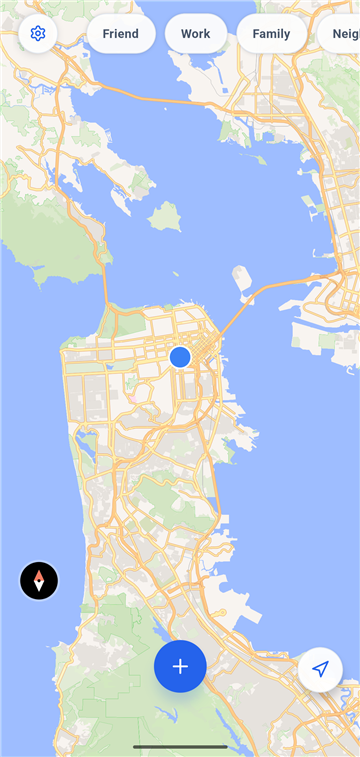
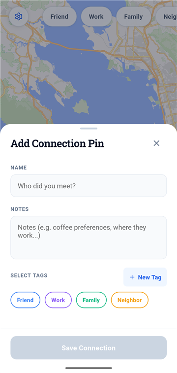
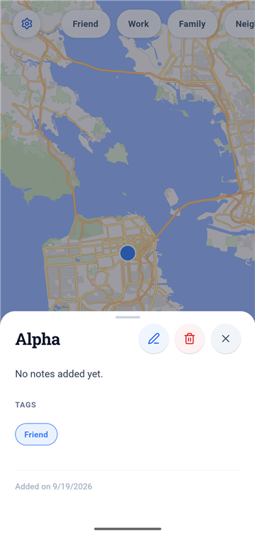
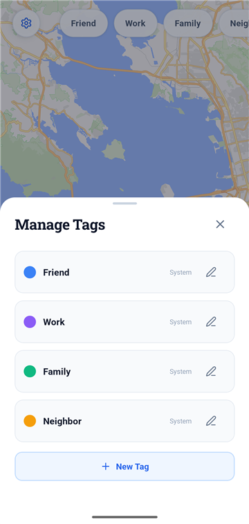

<p align="center">
  
  
  
  
</p>

# Nameplace Mobile

<p align="center">
  <a href="LICENSE"></a>
  <a href="https://github.com/aohana182/nameplace-mobile/issues"></a>
  
</p>

**Nameplace pins the people you meet to the places you met them, and keeps every name and note on your phone.**

<table>
<tr><td><b>Pin the moment</b></td><td>Long-press the map, or tap +, and save a name, notes and tags before you forget them.</td></tr>
<tr><td><b>Find people by place</b></td><td>Every connection is a colored pin on the map. Tap one to see who it was and how you met.</td></tr>
<tr><td><b>Sort with your own tags</b></td><td>Four built-in tags plus your own in eight colors, and one row of chips that filters the map.</td></tr>
<tr><td><b>Nothing leaves the device</b></td><td>The app has no accounts, analytics or backend. Your pins live in a database on your phone.</td></tr>
</table>

---

## What's shipped

Version 1.0.0, the local-only build. It runs on Android and has been used on a Samsung S24 and an Android emulator.

- The map has a locate button and a + button that drops a pin at the center of the screen. Long-press drops one anywhere.
- A pin holds a name, notes and any number of tags. Edit or delete it from its sheet.
- Four built-in tags (Friend, Work, Family, Neighbor) can't be deleted. You can add custom tags with a name and one of eight colors, and rename, recolor or delete them in Manage Tags.
- A row of tag chips over the map filters the pins. Select one or more to show only those.
- The map reopens where you left it.
- Your data is stored in an on-device SQLite database (WatermelonDB). The only network traffic is map tiles and styles from [OpenFreeMap](https://openfreemap.org). Pins, notes and your GPS position are never sent anywhere.
- The app gives haptic feedback on the main actions, and an error boundary catches rendering faults instead of closing the app.

## Roadmap

Nothing below is built yet.

| Next | What it needs |
|---|---|
| **Play Store release** | A release signing key, a real app icon, store screenshots and feature graphic, a hosted privacy policy, and Play Console setup. The full checklist is in [release/RELEASE_PREP.md](release/RELEASE_PREP.md). |
| **iOS** | The code is cross-platform, but the app has never been built or run on iOS. |
| **v2: encrypted cloud backup** | Opt-in. Email and password sign-in through Supabase. A key derived on the device from your password, AES-GCM-256 encryption before upload, and a debounced background sync. The server would store only encrypted blobs, so it could never read a name or a coordinate. It also needs a schema migration first. The design is in [PRD.md](PRD.md) section 4. |

---

## Quick start

Nameplace uses native modules (MapLibre, WatermelonDB), so it does not run in Expo Go. You need a development build, which needs JDK 21 and the Android SDK.

```sh
git clone https://github.com/aohana182/nameplace-mobile.git
cd nameplace-mobile
npm install
npx expo run:android   # builds and installs the dev client
npm start              # starts Metro
```

Open the installed **nameplace-mobile** app on your device or emulator; it connects to Metro.

**Windows:** keep the checkout path short. The native build fails when a generated path passes 260 characters. See [CONTRIBUTING.md](CONTRIBUTING.md).

---

## Tech stack

- [Expo](https://expo.dev) SDK 56 and React Native 0.85, in TypeScript
- [MapLibre](https://maplibre.org) with OpenFreeMap vector tiles for the map. No API key.
- [WatermelonDB](https://watermelondb.dev) on SQLite for storage and reactive queries
- `expo-location` for GPS, with a timeout so a slow fix can't hang the screen
- `expo-haptics`, `lucide-react-native` and `react-native-svg` for touch feedback and icons
- Jest and Testing Library for tests

---

## Scripts

| Command | Description |
|---|---|
| `npm start` | Start the Metro dev server |
| `npm run android` | Build and run the Android dev client |
| `npm run ios` | Build and run on iOS (untested) |
| `npm test` | Run the test suite |
| `npx tsc --noEmit` | Type-check. The bar is zero errors. |

---

## Project layout

- `src/screens/`: the map screen
- `src/components/`: the add-pin, pin-details and manage-tags sheets, and the shared sheet overlay
- `src/model/`: database schema, models, migrations, seed data
- `src/services/`: location
- `src/test/`: tests

For the current state of the project and how it is built, read [HANDOFF.md](HANDOFF.md). Architecture decisions are in [DECISION_LOG.md](DECISION_LOG.md).

---

## Contributing

```sh
git clone https://github.com/aohana182/nameplace-mobile.git
cd nameplace-mobile
npm install
npm test
```

See [CONTRIBUTING.md](CONTRIBUTING.md) for branching, commit format, and the PR process.

---

## License

MIT. See [LICENSE](LICENSE).
